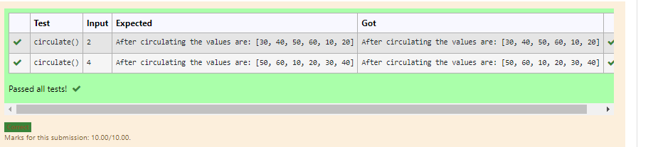

# Circulate-the-values-of-N-variables
## Aim:
To write a python program to circulate the n variables using function concept
## Equipment’s required:
PC
Anaconda - Python 3.7
## Algorithm: 
### Step 1:
import numpy
### Step 2:
enter the number of values 
### Step 3: 
Get the value from the user for the number of rotation
### Step 4: 
Using the slicing concept rotate the list

### Step 5:
shift all elements one position ahead and replace first element of array
### Step 6:
end the program 
## Program:
~~~
   def circulate():
    l=[10,20,30,40,50,60]
    n=int(input()) 
    l=l[n:]+l[:n]
    print("After circulating the values are:",l)
~~~

## Output:

## Result:
Thus the circulation of the values of the N variables is successfully solved using python program
